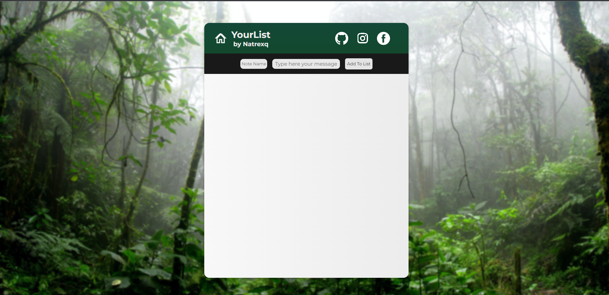
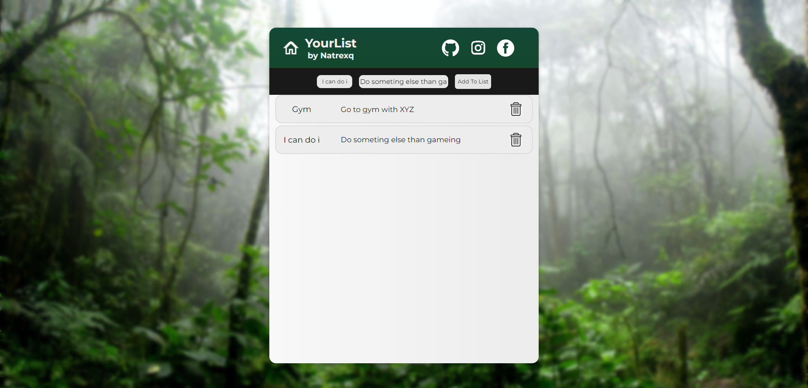

<<<<<<< HEAD
<<<<<<< HEAD
<h1 align="center"> 📓 To Do List</h1>
<h3 align="center"> ⭐ Hi, welcome in simple project of ToDo list. I maked it useing HTML CSS & JS. If you can do it, please give star for this project <3</h3>
   

   

=======
<h2>It's the same project but is branch for me (dev)h2>
>>>>>>> 85b9a07 (Create README.md)
=======
<h2 align="center">It's the same project but is branch for me (dev)<h2>
>>>>>>> 248ebec (Update README.md)
